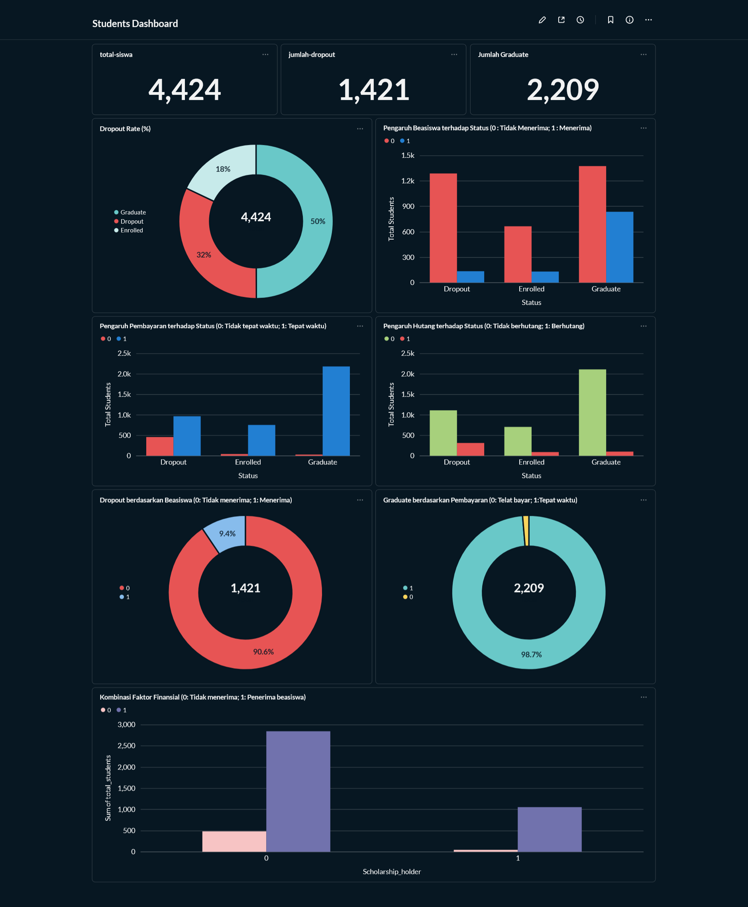

# Proyek Akhir: Menyelesaikan Permasalahan Institusi Pendidikan

## Business Understanding

Jaya Jaya Institut adalah institusi pendidikan tinggi yang beroperasi sejak tahun 2000 dan memiliki rekam jejak lulusan yang baik. Meski demikian, institusi masih menghadapi tantangan serius berupa jumlah siswa yang tidak menuntaskan studi (dropout).

Tingginya kasus dropout berdampak langsung pada kualitas hasil pendidikan dan keberlanjutan institusi. Karena itu, pihak institusi membutuhkan mekanisme deteksi dini agar siswa berisiko dapat segera memperoleh pendampingan yang tepat.

Proyek ini berfokus pada analisis data siswa untuk menemukan pola dropout, pemodelan machine learning untuk prediksi status siswa (Dropout, Enrolled, Graduate), serta penyusunan business dashboard guna membantu pemantauan performa siswa secara berkelanjutan.

### Permasalahan Bisnis

1. Persentase dropout yang tinggi berpotensi menurunkan reputasi serta mengganggu keberlanjutan institusi.
2. Belum tersedia mekanisme prediksi awal untuk mengidentifikasi siswa berisiko dropout.
3. Faktor-faktor utama penyebab dropout belum terpetakan secara jelas berbasis data.
4. Institusi membutuhkan dashboard monitoring untuk memantau performa siswa dan risiko dropout secara rutin.

### Cakupan Proyek

Cakupan pekerjaan pada studi kasus ini meliputi:
- Melakukan analisis data siswa untuk memahami karakteristik umum dan pola dropout.
- Mengidentifikasi faktor-faktor yang berkaitan dengan dropout:
    - **Faktor Demografi**: Age at enrollment, Gender, Marital Status, Nationality
    - **Faktor Akademik**: Previous qualification, Admission grade, Course, Application mode/order
    - **Faktor Performa Akademik**: Curricular units (credited, enrolled, evaluations, approved, grade) pada semester 1 dan 2
    - **Faktor Sosial-Ekonomi**: Mother's/Father's qualification & occupation, Scholarship holder, Tuition fees up to date, Debtor
    - **Faktor Ekonomi Makro**: Unemployment rate, Inflation rate, GDP
- Membangun model machine learning untuk prediksi status siswa (Dropout, Enrolled, Graduate).
- Membuat business dashboard berisi metrik dan visualisasi kunci performa siswa.
- Menyusun prototype sistem machine learning menggunakan Streamlit.
- Menyajikan kesimpulan dan rekomendasi action items untuk mendukung pengambilan keputusan institusi.

### Persiapan

Sumber data: https://github.com/dicodingacademy/dicoding_dataset/tree/main/students_performance

Dataset ini memuat data siswa pendidikan tinggi dari berbagai program sarjana. Informasi yang tersedia mencakup data saat pendaftaran (jalur akademik, demografi, sosial-ekonomi) dan capaian akademik hingga akhir semester 1 dan 2.

**Deskripsi Variabel:**

| Variabel | Deskripsi |
|----------|-----------|
| Marital_status | Status pernikahan (1-single, 2-married, 3-widower, 4-divorced, 5-facto union, 6-legally separated) |
| Application_mode | Mode pendaftaran |
| Application_order | Urutan pilihan pendaftaran (0-pilihan pertama sampai 9-pilihan terakhir) |
| Course | Program studi yang diambil |
| Daytime_evening_attendance | Waktu kuliah (1-siang, 0-malam) |
| Previous_qualification | Kualifikasi pendidikan sebelumnya |
| Previous_qualification_grade | Nilai kualifikasi sebelumnya (0-200) |
| Nacionality | Kewarganegaraan |
| Mothers_qualification | Kualifikasi pendidikan ibu |
| Fathers_qualification | Kualifikasi pendidikan ayah |
| Mothers_occupation | Pekerjaan ibu |
| Fathers_occupation | Pekerjaan ayah |
| Admission_grade | Nilai masuk (0-200) |
| Displaced | Apakah siswa pindahan (1-ya, 0-tidak) |
| Educational_special_needs | Kebutuhan pendidikan khusus (1-ya, 0-tidak) |
| Debtor | Status hutang (1-ya, 0-tidak) |
| Tuition_fees_up_to_date | Biaya kuliah terbayar tepat waktu (1-ya, 0-tidak) |
| Gender | Jenis kelamin (1-pria, 0-wanita) |
| Scholarship_holder | Penerima beasiswa (1-ya, 0-tidak) |
| Age_at_enrollment | Usia saat mendaftar |
| International | Siswa internasional (1-ya, 0-tidak) |
| Curricular_units_1st_sem_credited | Jumlah unit kurikuler yang dikreditkan di semester 1 |
| Curricular_units_1st_sem_enrolled | Jumlah unit kurikuler yang terdaftar di semester 1 |
| Curricular_units_1st_sem_evaluations | Jumlah evaluasi unit kurikuler di semester 1 |
| Curricular_units_1st_sem_approved | Jumlah unit kurikuler yang lulus di semester 1 |
| Curricular_units_1st_sem_grade | Rata-rata nilai di semester 1 (0-20) |
| Curricular_units_1st_sem_without_evaluations | Jumlah unit kurikuler tanpa evaluasi di semester 1 |
| Curricular_units_2nd_sem_credited | Jumlah unit kurikuler yang dikreditkan di semester 2 |
| Curricular_units_2nd_sem_enrolled | Jumlah unit kurikuler yang terdaftar di semester 2 |
| Curricular_units_2nd_sem_evaluations | Jumlah evaluasi unit kurikuler di semester 2 |
| Curricular_units_2nd_sem_approved | Jumlah unit kurikuler yang lulus di semester 2 |
| Curricular_units_2nd_sem_grade | Rata-rata nilai di semester 2 (0-20) |
| Curricular_units_2nd_sem_without_evaluations | Jumlah unit kurikuler tanpa evaluasi di semester 2 |
| Unemployment_rate | Tingkat pengangguran (%) |
| Inflation_rate | Tingkat inflasi (%) |
| GDP | Produk Domestik Bruto |
| Status | Target variable - status siswa (Dropout, Enrolled, Graduate) |

**Setup environment:**

**Opsi 1: Menggunakan Anaconda**
```bash
conda create --name student-performance python=3.9
conda activate student-performance
pip install -r requirements.txt
```

**Opsi 2: Menggunakan Shell/Terminal**
```bash
pip install pipenv
pipenv install
pipenv shell
pip install -r requirements.txt
pip install notebook
jupyter-notebook .
```

### Metabase dengan Docker

Langkah-langkah:

1. Install Docker
2. Jalankan perintah berikut pada Terminal/Command Prompt/PowerShell guna memanggil (pull) Docker image untuk menjalankan Metabase.
    ```
    docker pull metabase/metabase:v0.46.4
    ```
3. Selanjutnya,
    ```
    docker run -p 3000:3000 --name metabase metabase/metabase:v0.46.4
    ```
    atau:
    ```
    docker run -p 3000:3000 --name metabase metabase/metabase
    ```
4. Masuk ke metabase dengan URL berikut : http://localhost:3000/setup
    Gunakan akun login berikut ini:
    ```
    Email : root@gmail.com
    Password : root123
    ```

### Mengirim Dataset ke Database Supabase 

1. Siapkan supabase, pastikan sudah login dan membuat Project
2. Untuk mengirim dataset ke database, ke bagian menu "Project Overview", lalu scroll kebawah, akan ada "connect", Ubah dulu Methodnya jadi Transaction Pooler, lalu salin DATABASE_URL nya.
3. Setelah itu, gunakan perintah berikut ini:
    ```
    from sqlalchemy import create_engine
 
    URL = "DATABASE_URL"
 
    engine = create_engine(URL)
    df.to_sql('orders', engine)

    ```  

### Hubungkan Metabase dengan Databse

1. Pastikan sudah masuk Admin setting pada metabase
2. Hubungkan dengan isi field seperti dibawah:
    ```
    Database type : SQLite
    Database file : students.db
    Display name : Student-Dropout-Analysis
    ```
    
    Pilih file database `students.db` saat proses koneksi di Metabase.

## Business Dashboard

Business dashboard disusun untuk membantu Jaya Jaya Institut memantau tingkat dropout sekaligus membaca faktor-faktor yang berasosiasi dengan status akhir siswa. Tampilan dashboard dibagi menjadi beberapa bagian agar mudah digunakan oleh pihak manajemen.



### Ringkasan Statistik Siswa

Bagian atas dashboard menampilkan KPI cards sebagai ringkasan kondisi siswa:
- **Total Siswa**: 4,424 siswa
- **Jumlah Dropout**: 1,421 siswa
- **Jumlah Graduate**: 2,209 siswa

### Distribusi Status Siswa (Dropout Rate)

Visualisasi donut chart memperlihatkan komposisi status siswa:
- **Graduate**: 50% (2,209 siswa)
- **Dropout**: 32% (1,421 siswa)
- **Enrolled**: 18% (794 siswa)

Tingkat dropout sebesar **32%** menunjukkan bahwa hampir sepertiga siswa belum menyelesaikan studi, sehingga perlu menjadi fokus intervensi institusi.

### Pengaruh Faktor Finansial terhadap Status Siswa

Dashboard menyoroti tiga faktor finansial utama yang terkait dengan status siswa:

**1. Pengaruh Beasiswa terhadap Status**

Visualisasi menunjukkan siswa penerima beasiswa (1) memiliki proporsi Graduate lebih tinggi dibanding non-penerima (0). Pada donut chart "Dropout berdasarkan Beasiswa", terlihat **90.6% siswa dropout tidak menerima beasiswa**, sedangkan hanya **9.4% yang menerima beasiswa**. Temuan ini menandakan beasiswa berperan penting dalam keberlanjutan studi.

**2. Pengaruh Pembayaran terhadap Status**

Siswa yang membayar biaya kuliah tepat waktu (1) memiliki peluang kelulusan yang jauh lebih tinggi. Pada visualisasi "Graduate berdasarkan Pembayaran", **98.7% siswa yang lulus membayar tepat waktu**. Sebaliknya, keterlambatan pembayaran cenderung muncul pada kelompok dropout, sehingga faktor ini menjadi indikator risiko yang kuat.

**3. Pengaruh Hutang terhadap Status**

Visualisasi memperlihatkan siswa dengan status hutang (1) cenderung memiliki proporsi dropout lebih tinggi dibanding kategori lainnya.

### Kombinasi Faktor Finansial

Grafik bar di bagian bawah menunjukkan kombinasi status beasiswa dan status pembayaran. Kelompok terbesar adalah siswa **tanpa beasiswa namun membayar tepat waktu**. Di sisi lain, kelompok penerima beasiswa berjumlah lebih kecil tetapi menunjukkan capaian yang relatif baik.

### Insight Utama dari Dashboard

1. **Pembayaran tepat waktu** menjadi indikator paling kuat terhadap keberhasilan studi (98.7% Graduate membayar tepat waktu).
2. **Beasiswa** berkontribusi dalam menurunkan risiko dropout (90.6% Dropout tidak menerima beasiswa).
3. **Status hutang** berkaitan dengan peningkatan risiko dropout.
4. Kombinasi variabel finansial (beasiswa + ketepatan pembayaran) relevan untuk early warning system siswa berisiko.

## Menjalankan Sistem Machine Learning

Prototype sistem machine learning untuk memprediksi status siswa (Dropout, Enrolled, Graduate) dibangun menggunakan **Streamlit**. Aplikasi menerima input data siswa lalu menampilkan hasil prediksi beserta probabilitas tiap kelas.

### Cara Menjalankan Secara Lokal

1. **Pastikan semua dependencies terinstall:**
```bash
pip install -r requirements.txt
```

2. **Jalankan aplikasi Streamlit:**
```bash
streamlit run app.py
```

3. **Akses aplikasi melalui browser:**
   - Buka browser dan akses `http://localhost:8501`

### Fitur Aplikasi

Aplikasi menyediakan fitur:
- **Input Data Siswa**: Form untuk memasukkan data akademik (jumlah MK lulus dan nilai semester 1 & 2), faktor finansial (status pembayaran, status hutang), dan demografi (usia saat mendaftar).
- **Prediksi Status**: Menampilkan hasil prediksi status siswa (Dropout/Enrolled/Graduate).
- **Probabilitas Prediksi**: Menampilkan probabilitas untuk setiap kelas.
- **Rekomendasi Tindakan**: Memberikan rekomendasi intervensi jika siswa diprediksi Dropout.

### Link Akses Prototype (Deployment)

🔗 **Link Streamlit Cloud:** [Student Dropout Prediction App](https://mazdeus-student-dropout-analysis.streamlit.app/)

*Catatan: Jika link tidak tersedia, jalankan aplikasi secara lokal menggunakan langkah-langkah di atas.*

## Conclusion

Berdasarkan analisis data, business dashboard, serta model machine learning yang dikembangkan, diperoleh kesimpulan berikut:

### Performa Model Machine Learning

Model **Random Forest** dipilih sebagai model terbaik dengan performa:
- **Akurasi**: 89%
- **Precision untuk Dropout**: 0.87 (87%)
- **Recall untuk Dropout**: 0.84 (84%)
- **F1-Score untuk Dropout**: 0.85

Model ini menggunakan **7 fitur** yang dipilih melalui EDA dan pertimbangan domain knowledge:
1. Jumlah mata kuliah lulus semester 1 & 2
2. Rata-rata nilai semester 1 & 2
3. Status pembayaran biaya kuliah tepat waktu
4. Status hutang
5. Usia saat mendaftar

### Faktor yang Berpengaruh terhadap Dropout

- **Performa akademik rendah** (jumlah MK lulus sedikit dan nilai semester rendah) menjadi sinyal kuat risiko Dropout.
- **Pembayaran biaya kuliah tidak tepat waktu** berasosiasi kuat dengan peluang Dropout (98.7% siswa Graduate membayar tepat waktu).
- **Tidak menerima beasiswa** meningkatkan risiko Dropout secara signifikan (90.6% siswa Dropout tidak menerima beasiswa).
- **Status hutang** berkorelasi dengan risiko Dropout yang lebih tinggi.
- **Usia pendaftaran yang lebih tinggi** cenderung terkait dengan peluang Dropout yang lebih besar.

### Faktor yang Kurang Berpengaruh Signifikan terhadap Dropout

- **Faktor ekonomi makro** (unemployment rate, inflation rate, GDP) tidak menunjukkan sinyal kuat terhadap status Dropout.
- **Kualifikasi dan pekerjaan orang tua** bukan variabel dominan untuk menjelaskan keberhasilan studi.
- **Nilai masuk (Admission grade)** cenderung kurang kuat dibanding performa akademik selama perkuliahan.

### Statistik Utama

- **Total siswa**: 4,424
- **Tingkat Dropout**: 32% (1,421 siswa)
- **Tingkat Graduate**: 50% (2,209 siswa)
- **Tingkat Enrolled**: 18% (794 siswa)

### Rekomendasi Action Items

Berdasarkan temuan analisis pada proyek ini, berikut rekomendasi action items untuk menekan tingkat Dropout di Jaya Jaya Institut:

1. **Implementasi Early Warning System**
   - Menggunakan model machine learning yang sudah dikembangkan untuk mengenali siswa berisiko Dropout sejak awal semester.
   - Melakukan pemantauan performa akademik secara berkala, terutama setelah evaluasi semester 1 dan 2.

2. **Program Intervensi Akademik**
   - Menyediakan program bimbingan/tutoring bagi siswa dengan performa akademik rendah (jumlah MK lulus sedikit atau nilai rendah).
   - Menyiapkan konseling akademik untuk membantu siswa menyusun strategi belajar yang lebih efektif.

3. **Dukungan Finansial yang Lebih Terarah**
   - Memperluas cakupan beasiswa bagi siswa potensial dengan keterbatasan finansial, mengingat 90.6% siswa Dropout tidak menerima beasiswa.
   - Menyediakan skema cicilan atau keringanan biaya kuliah untuk siswa yang kesulitan membayar tepat waktu.
   - Menyediakan bantuan atau konseling finansial untuk siswa dengan status hutang.

4. **Monitoring Pembayaran dan Intervensi Proaktif**
   - Memantau status pembayaran biaya kuliah secara lebih cepat dan menghubungi siswa yang mulai menunggak sebelum risikonya meningkat.
   - Menawarkan opsi pembayaran alternatif sebelum siswa memutuskan untuk Dropout.

5. **Program Khusus untuk Siswa dengan Usia Lebih Tua**
   - Menyusun program fleksibilitas jadwal atau kelas khusus bagi siswa yang mendaftar pada usia lebih tua dan memiliki tanggung jawab lain (pekerjaan/keluarga).
   - Menyediakan layanan konseling untuk membantu keseimbangan antara studi dan tanggung jawab personal.

6. **Evaluasi dan Perbaikan Berkelanjutan**
   - Melakukan evaluasi berkala terhadap efektivitas program intervensi yang dijalankan.
   - Memperbarui model machine learning secara periodik menggunakan data terbaru agar akurasi prediksi tetap terjaga.
